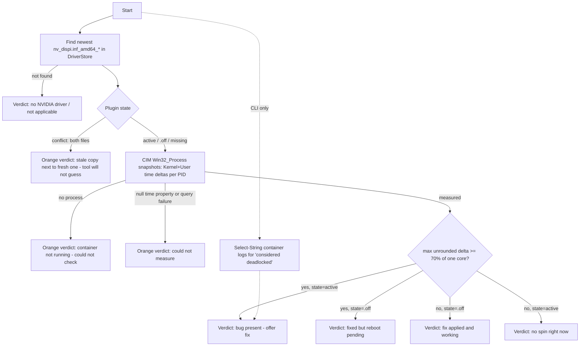
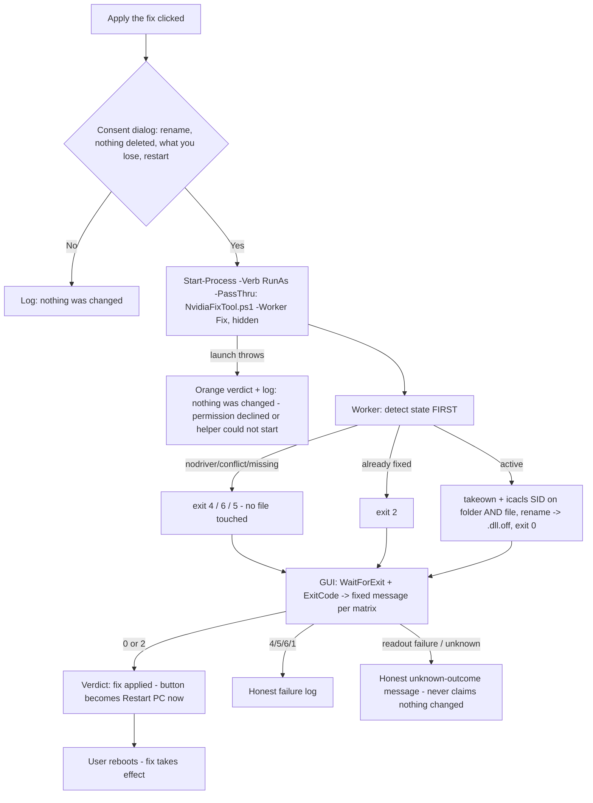

# nvidia-container-spin-fix Architecture Documentation

## 1. How to Read This Document

This document is the maintained architecture snapshot for the project. It describes what the tools do, how they are structured, and — most importantly for this project — the **safety invariants** that every change must preserve, because the code runs with administrator rights on strangers' PCs and modifies a file inside the Windows DriverStore.

Audience: AI agents and human contributors making changes. Read this fully before planning or implementing. `AGENTS.md` (repo root) is the short-form contract; this document is the detailed reference. `evidence.md` is the investigation record the whole fix rests on — read it before touching anything about fix semantics.

## 2. Overview

The project diagnoses and fixes a specific NVIDIA display-driver bug: `nvprofileupdaterplugin.dll` (the game-profile auto-updater plugin loaded by `NVDisplay.Container.exe`) busy-spins one full CPU core from boot **and** deadlocks the container's shutdown, making stuck processes unkillable and defeating every conventional remedy (service restarts, DDU, driver reinstalls, Windows reset).

The fix is deliberately minimal: rename the plugin to `nvprofileupdaterplugin.dll.off` inside the driver's Session plugin folder so the container never loads it, then have the user reboot. Nothing is deleted, no service is touched, and the rename is reversible.

Two delivery surfaces share this one fix:

| Surface | File(s) | Audience |
|---|---|---|
| CLI script | `Fix-NvContainerSpin.ps1` | Technical users; full diagnosis output |
| Easy GUI tool | `easy-tool/` (START-HERE.bat → NvidiaFixTool.ps1) | Non-technical users; plain-English verdicts, one-button fix/undo |

Both are plain, readable PowerShell — being auditable in Notepad is part of the trust model.

## 3. Technology Stack

- **Language**: PowerShell targeting **Windows PowerShell 5.1** (stock on Windows 10/11). No PS7-only syntax, no modules, no external dependencies, no internet access assumed — the scripts must run on an untouched end-user machine.
- **GUI**: Windows Forms via `Add-Type` (`System.Windows.Forms`, `System.Drawing`) — in-box .NET Framework assemblies, no packages.
- **Launcher**: `START-HERE.bat` (cmd batch) — the double-click entry point that starts the GUI hidden-console, STA, with `-ExecutionPolicy Bypass`.
- **System tools invoked**: `takeown.exe`, `icacls.exe` (DriverStore ownership, granted via the `*S-1-5-32-544` SID so localized group names can't break it), `shutdown.exe` (GUI restart button), CPU sampling via CIM (`Get-CimInstance Win32_Process` — in-box `CimCmdlets`).
- **Platform**: Windows 10/11 with an NVIDIA display driver. Nothing here runs on other platforms.

## 4. Project Structure

```
nvidia-container-spin-fix/
├── Fix-NvContainerSpin.ps1     # Core CLI tool: Diagnose (default) / Fix / Revert modes
├── easy-tool/
│   ├── START-HERE.bat          # Double-click launcher (hidden console, STA, Bypass)
│   ├── NvidiaFixTool.ps1       # WinForms GUI + hidden elevated worker mode
│   └── ReadMe.txt              # Plain-English instructions for non-technical users
├── README.md                   # User-facing contract: symptoms, root cause, fix, download
├── evidence.md                 # Investigation record: logs proving spin + shutdown deadlock
├── LICENSE                     # MIT
├── AGENTS.md                   # Short-form rules for AI agents (invariants, ownership)
└── docs/                       # TRIP workflow documentation (this file, plans, changelogs…)
```

Duplication note: `Get-NvSessionPluginDir` and the CPU-measurement helper exist in **both** scripts by design — each script must be a self-contained single file a user can download and audit. Behavior changes to these helpers must be applied to both copies.

## 5. Core Architecture Principles

These are the project's invariants. They come from `AGENTS.md` and from hard-won evidence (`evidence.md`); violating any of them is a Critical review finding.

1. **Diagnose is strictly read-only.** `-Mode Diagnose` (CLI) and the GUI's diagnosis pass never write, rename, elevate, or change state. Users are told it is safe to run — that promise is load-bearing.
2. **Fix is a rename, never a delete — and always reversible by Revert.** The `.off` rename is the entire mechanism. `-Mode Revert` must always be able to undo `-Mode Fix`.
3. **Never start/stop/restart the NVIDIA container service programmatically.** On affected machines, stopping the container triggers the shutdown deadlock and leaves an unkillable process that blocks its replacement (see evidence.md §2–§4). The contract is: *change the file, tell the user to reboot*. This is why the scripts deliberately do not "apply" the fix live.
4. **PowerShell 5.1, single-file, zero dependencies.** Each deliverable script runs on a stock machine as downloaded. No modules, no dot-sourcing between files, no internet.
5. **Plain-English, honest UX.** The GUI explains what it found and what will happen before doing it; elevation is announced; failure paths say "nothing was changed" when true. The easy-tool must remain usable by someone who has never opened a terminal (START-HERE.bat is the only entry point they need).
6. **Fix semantics are human-owned.** What gets disabled on end users' machines, risk/reversibility messaging, and anything altering what Fix/Revert touches is owned by Richard Wilken. Agents implement what a plan specifies and flag end-user-safety judgment calls instead of deciding.

## 6. Build System & Toolchain

There is no build step — the scripts ship as written. The only assembly work is release packaging:

- `Fix-NvContainerSpin.ps1` is attached to the GitHub release as-is.
- `easy-tool/` is zipped as `NVIDIA-Container-Fix-EasyTool.zip` (the zip contains `START-HERE.bat`, `NvidiaFixTool.ps1`, `ReadMe.txt` at the top level so "extract anywhere and double-click" works).

The README's Download section points at `releases/latest/download/<asset>`, so release asset **names are a stable contract** — renaming them breaks the README of every previously cloned copy and any external links. Step-by-step packaging instructions: §22.

Line endings: `.gitattributes` forces LF only under `.claude/skills/`; the shipped scripts stay with default (CRLF-friendly) handling, which is what Windows tools expect.

## 7. Configuration

There is no configuration system — no config files, no environment variables, no registry use, and (since v1.2.0) no persisted artifacts at all: the former `%TEMP%` worker result file was removed when worker IPC moved to process exit codes (§12). All behavior is selected by command-line parameters (see §8).

## 8. Command Structure

### Fix-NvContainerSpin.ps1 (CLI)

```
Fix-NvContainerSpin.ps1 [-Mode Diagnose|Fix|Revert]   # default: Diagnose
```

- **Diagnose** (default, read-only): reports logical-core count and the expected one-core percentage; locates the plugin folder; reports plugin state (active / DISABLED `.off` / CONFLICT both present / missing); samples per-process container CPU via CIM time deltas (§9); greps NVIDIA's own container logs for the deadlock signature (`considered deadlocked`); prints a verdict (matches the bug / fix applied and working / conflict guidance / inconclusive).
- **Fix**: resolves conflict and no-op cases **before** elevating (no pointless UAC prompt), self-elevates if needed (script path quoted — spaced paths work), confirms with the user (`Read-Host` y/N), takes ownership of the plugin folder **and** file, renames the plugin to `.off`, then instructs a reboot — explicitly warning not to restart the service instead. Post-elevation rechecks are retained as the authoritative race-safe checks.
- **Revert**: renames `.off` back to stock; reminds the user to reboot. Same pre-elevation no-op/conflict resolution.

Spin detection threshold: a container instance is "spinning" when its CPU (as % of total) is ≥ 70% of one core's share. Both surfaces compute the threshold from the **unrounded** `100.0 / cores`; rounding is display-only.

### NvidiaFixTool.ps1 (GUI + worker)

```
NvidiaFixTool.ps1                       # GUI mode (normal use, via START-HERE.bat)
NvidiaFixTool.ps1 -Worker Fix|Revert    # internal: hidden elevated helper
NvidiaFixTool.ps1 -SelfTest             # constructs the GUI off-screen, prints state, exits
```

The GUI runs unelevated; only the short-lived worker process elevates (§12). `-SelfTest` exists as the automated smoke check (§18).

## 9. Target System Interaction Model

How the scripts read and change the machine — shared logic duplicated in both scripts:

- **Driver discovery**: newest `nv_dispi.inf_amd64_*` folder under `C:\Windows\System32\DriverStore\FileRepository` (by `LastWriteTime`), then `Display.NvContainer\plugins\Session` inside it. If absent → "no NVIDIA driver" path.
- **Plugin state model** (GUI: `Get-PluginState`, worker, and CLI inline): `nodriver` / `fixed` (`.off` only) / `active` (stock only) / `conflict` (both present — e.g. after an in-place driver reinstall; diagnosis reports it, Fix/Revert decline to guess) / `missing` (neither — unusual layout).
- **CPU measurement** (locale-neutral, v1.2.0): snapshots of `Get-CimInstance Win32_Process -Filter "Name = 'NVDisplay.Container.exe'"`, per-PID CPU time = `KernelModeTime + UserModeTime` (100 ns units), delta over stopwatch-measured window seconds / cores × 100 = % of total CPU. CLI: 3 snapshots → two 3 s windows; GUI: 2 snapshots → one 3 s window; verdicts use the maximum unrounded delta across PIDs and windows. Three outcomes — **Measured / NoProcess / Failed** — and only Measured can produce a "healthy" or "spinning" verdict; the other two map to indeterminate. **Fabrication guard**: a `$null` time property maps to Failed, never zero (`Process.TotalProcessorTime` silently reads `$null` for SYSTEM processes unelevated — the trap that killed the first replacement mechanism; `Get-Counter` before it broke on localized Windows counter names).
- **Log signature**: `Select-String` for `considered deadlocked` in `%ProgramData%\NVIDIA\DisplaySessionContainer*.log*` — NVIDIA's own watchdog confirming the bug (Diagnose only).
- **The change itself**: `Rename-Item` of exactly one file between `nvprofileupdaterplugin.dll` and `…dll.off`. Renaming (not moving/deleting) keeps the driver package intact and the operation trivially reversible. Note from field debugging (README §Notes): renaming to a different *`.dll` name* does **not** disable a plugin — the container loads every `*.dll` in the folder — so the `.off` extension change is essential, not cosmetic.

Known external caveat: every NVIDIA driver install/update rewrites the plugin folder and re-enables the plugin. Both surfaces tell the user to just run the tool again.

## 10. Known Failure Modes & Field-Debugging Protocol

Hard-won knowledge from the original investigation (README §Notes, evidence.md). Anyone extending diagnosis or fix behavior must know these, because several "obvious" approaches actively fail:

- **Renaming to another `.dll` name does not disable a plugin.** The container loads every `*.dll` in the Session folder regardless of filename — `DISABLED_nvprofileupdaterplugin.dll` still loads. Only changing the extension (the `.off` scheme) or removing the file from the folder works.
- **The container watches the plugin folder live.** Its directory watcher re-registers renamed files under their new name (logs show entries like `Unload plugin 'NvXDSyncPlugin' - ...\DISABLED_nvxdsyncplugin.dll`). File changes while the container runs do not behave predictably — hence the reboot contract.
- **No live A/B testing on an affected machine.** Removing a mandatory plugin makes the container exit; the exit deadlocks (evidence.md §2); the wedged process blocks its replacement from spawning. **One experiment per reboot** is the only reliable protocol.
- **The stuck process is genuinely unkillable.** `taskkill /F` returns "There is no running instance of the task" while the process keeps burning CPU; even the container's own fail-fast abort (exception `0xc0000409`, Event 1000) leaves it running (evidence.md §3). Nothing but a reboot clears it — which is why invariant §5.3 forbids touching the service.
- **Service restart makes things worse, not better.** The old container survives as an unkillable leftover and can block the service until reboot. Users arrive having usually already tried this.
- **"Fixed but still spinning" is an expected state.** After the rename, the pre-existing stuck process persists until reboot; both surfaces represent this as its own verdict (reboot pending), not as a failure.
- **Driver installs/updates silently revert the fix.** Every driver package rebuilds the plugin folder. Not a bug in this tool — both surfaces document "run the tool again".

## 11. Compatibility Matrix

Confirmed affected configurations (source: evidence.md):

| GPU | Driver | Windows | Cores | Result |
|---|---|---|---|---|
| RTX 5070 Ti | 610.88 (32.0.16.1088) | 11, build 26200 | 8 | Bug confirmed; fix verified working |

The detection logic is configuration-agnostic by design: the spin threshold is computed from `[Environment]::ProcessorCount` (≥ 70% of one core's share of total CPU), and driver discovery takes whatever `nv_dispi.inf_amd64_*` folder is newest — no hardcoded versions or paths. Since v1.2.0 there are also **no locale-sensitive identifiers** (no English counter paths, no localized group names — CIM classes and SIDs only), so non-English Windows is supported by design (verified by construction, not yet by a field report).

**Recording new reports**: when users report results (GitHub issues), capture GPU model, driver version, Windows build, logical-core count, the Diagnose verdict, and whether the fix worked — then add a row here. Contradicting reports (bug present but plugin layout differs, fix ineffective) are architecture-relevant and may warrant changes to the discovery or verdict logic.

## 12. Elevation & Privilege Model

DriverStore contents belong to TrustedInstaller, so the rename needs ownership of the **parent folder and the file** (both — a rename writes to the directory), taken via `takeown.exe` + `icacls.exe /grant '*S-1-5-32-544:F'` (the Administrators SID — localized group names broke the name form).

Two different elevation shapes, on purpose:

- **CLI**: if not admin, relaunches itself elevated (`Start-Process -Verb RunAs`, quoted script path) with the same `-Mode`, in a visible `-NoExit` console so the user sees the result. Conflict and no-op cases resolve **before** elevation. Diagnose never elevates.
- **GUI**: stays unelevated for its whole life. Fix/Undo spawn a **hidden elevated worker** (`-Worker Fix|Revert`, `-Verb RunAs -WindowStyle Hidden -PassThru`). The worker communicates back **solely through its process exit code** (matrix in §14), read via `WaitForExit()` + `ExitCode` — robust across UAC account boundaries, no writable-file surface (the v1.1.0 `%TEMP%` result file silently lost results when a standard user elevated as a different admin). Two separate failure scopes with different honest messages: launch failure ("Permission was declined or the helper could not start — nothing was changed") vs readout failure ("couldn't confirm what happened — restart your PC, then run this tool again to check"; never claims nothing changed, because the worker may have completed). The distinction carries through to the verdict label: launch failure returns a `'declined'` sentinel and the handlers show "Nothing was changed" (a known fact — the worker never ran), while readout failure returns `$null` and the verdict honestly says "Could not confirm".

This split keeps the window responsive, avoids running WinForms elevated, and gives the worker a machine-parseable outcome protocol.

## 13. GUI Architecture (easy-tool)

Single fixed-size WinForms window, built imperatively, driven by one state function:

- **Widgets**: header, one-line subtitle, a bold colored **verdict label** (the primary output), a read-only Consolas **log textbox** (the detail trail), an **action button** (context-dependent: "Apply the fix" / "Restart PC now"), "Check again", "Undo the fix", and a GitHub link.
- **`Invoke-Diagnosis`** is the heart: it re-runs the full read-only diagnosis and maps `(measurement outcome × pluginState)` onto verdict text, verdict color, and button visibility:
  - conflict → orange *could not continue safely* + guidance; Apply/Undo hidden (measurement skipped)
  - NoProcess / Failed measurement → orange *could not check* verdicts; no spin branching without data
  - spin + active → *Problem found — and this tool can fix it* → show **Apply the fix** (green)
  - spin + fixed → *restart still needed* → show **Restart PC now** (blue) + Undo
  - no spin + fixed → *all good* → show Undo
  - no spin + active → *no problem detected right now*
  - nodriver / anything else → orange "can't determine" verdicts
- **Event flow**: `Form.Shown` → diagnosis; Apply → **consent dialog** (Yes/No MessageBox stating the owner-pinned facts: one file renamed, nothing deleted, Undo restores it, what you lose, UAC next, restart finishes) → worker Fix → on success the same button morphs into "Restart PC now" (`shutdown.exe /r /t 10`); Undo → worker Revert → on code 0 a dedicated **post-Revert state** (blue "Undo complete — restart your PC to finish", Restart button, log preserved — deliberately *not* a re-diagnosis, which would wipe the restart instruction); Apply and Undo failure outcomes get their own orange verdicts (never a stale success/problem verdict above a failure log); "Check again" → re-diagnosis.
- **Responsiveness**: long operations pump the message loop with `[Application]::DoEvents()` after each log/verdict update rather than using background threads. Because queued clicks dispatch through `DoEvents`, the Apply and Undo handlers disable every actionable button for their full duration (Undo is not visible in the Apply path; re-enabled only after outcome rendering) — the guard against mid-handler re-entry.
- Color vocabulary is consistent: Firebrick = problem, ForestGreen = healthy, DarkOrange = attention/indeterminate, blue (#1565C0) = reboot pending.

## 14. Input/Output Handling

- **CLI output**: `Write-Host` with the same color vocabulary (Cyan headings, Red problem, Green healthy, Yellow attention). Structured as indented detail lines followed by a one-line `Verdict:`. The only interactive input is the Fix confirmation (`Read-Host`, default No).
- **Exit behavior**: the CLI uses `return` (not `exit`) so it is safe to dot-source or run in an existing console; `$ErrorActionPreference = 'Stop'` plus `throw` for genuinely unexpected layouts. It does not use exit codes as an API — verdicts are for humans.
- **Worker exit codes** — the one machine-readable interface in the project (v1.2.0; replaced the `OK|`/`ERR|` result file). Exhaustive (state × action) matrix, state detection first so no state satisfies two rows: `nodriver`→4, `conflict`→6 (no file touched), `missing`→5, `fixed`+Fix→2 (already fixed), `fixed`+Revert→rename→0, `active`+Fix→rename→0, `active`+Revert→3 (nothing to undo), unexpected error→1. GUI maps every code to a fixed plain-English message; 0/2/3 are success-class; unknown codes and readout failures map to the honest unknown-outcome message.

## 15. Docs & UX Copy Map

User-facing wording lives in five places with different audiences. Each fact has one authoritative home; the others carry simplified echoes that must be updated in the same change when the fact changes.

| Surface | Audience | Owns |
|---|---|---|
| `README.md` | Technical users, people linking to the project | The full contract: symptoms, root cause, manual fix commands, verification, disclaimer, download links |
| `evidence.md` | Skeptics, debuggers, NVIDIA | The proof: logs and measurements. Append-only in spirit — new evidence gets new sections, existing sections don't get reworded |
| `easy-tool/ReadMe.txt` | Non-technical users (inside the zip) | Plain-English how-to; the security-warning reassurance; what-you-lose in one sentence |
| `Fix-NvContainerSpin.ps1` comment header | Whoever downloads the bare script | A self-contained synopsis — the script travels alone and must explain itself without the README |
| `NvidiaFixTool.ps1` GUI strings | Non-technical users at runtime | Verdict lines, log lines, button labels |

**Facts that echo across surfaces** (change all in one commit): what you lose while the plugin is disabled; driver updates revert the fix; reboot is required and why service restart is forbidden; the fix is a rename, nothing is deleted; observed configuration (GPU/driver/build).

**Tone rules**: easy-tool surfaces (ReadMe.txt, GUI strings) use plain English — no jargon, no acronyms without explanation, sentence-case labels, and honest phrasing ("nothing was changed" only when literally true). Technical depth belongs in README.md and evidence.md. The GUI never blames the user and always names the next action (Apply / Restart / Check again / open an issue).

## 16. Data Flow Diagrams

### Diagnosis (both surfaces, read-only)



### Fix (GUI path; CLI is the same minus the worker hop)



## 17. Error Handling Strategy

- `$ErrorActionPreference = 'Stop'` in both scripts; probing calls that may legitimately fail (CIM query, DriverStore lookup, log grep) use `try/catch` and map failure to a *state* (`nodriver`, `NoProcess`, `Failed`, no signature) rather than an error. **A failed or unreadable measurement is never presented as a healthy number** — the fabrication guard maps null time samples to the Failed outcome.
- Unexpected layouts (plugin missing where it must exist) `throw` in the CLI and become exit code 5 in the worker — loud, specific, and abort before changing anything.
- The GUI never shows a raw exception to the user; every failure path produces a plain-English log line, and messages only claim "nothing was changed" when that is provably true (worker never launched, or exited with a no-file-touched code). Post-launch uncertainty gets the honest unknown-outcome message instead.
- There is no logging/telemetry of any kind — output goes to the console/window only, and nothing is written to disk outside the single plugin rename.

## 18. Testing Strategy

**There is no automated test suite**, and the paths that matter most (`Fix`/`Revert` on an affected machine) can only be truly verified on affected hardware. Verification is therefore layered:

1. **Syntax gate** (any machine): parse both scripts with the PowerShell 5.1 parser —
   ```
   powershell -NoProfile -Command "$e=$null; [void][System.Management.Automation.Language.Parser]::ParseFile('<script>',[ref]$null,[ref]$e); $e; if($e){exit 1}"
   ```
2. **Read-only smoke runs** (any machine, safe): `Fix-NvContainerSpin.ps1` with no arguments (Diagnose), and `NvidiaFixTool.ps1 -SelfTest` (constructs the GUI off-screen, prints plugin state, exits without showing a window). A "0%" smoke result alone cannot distinguish real-idle from a broken measurement — pair it with a **discrimination check** asserting the raw per-PID CIM time samples are non-null (the v1.2.0 review caught a mechanism whose fabricated zeros passed the plain smoke run).
3. **Manual review**: Fix/Revert/worker changes get extra review scrutiny *instead of* test runs — reviewers verify the invariants of §5 by reading, and behavioral verification on affected hardware is noted as an explicit follow-up when applicable.

PSScriptAnalyzer is not currently installed on the dev machine; if added later it becomes an optional extra lint layer, not a gate.

**5.1 compatibility is a review concern**: the syntax gate runs whatever PowerShell parses it, so PS7-only constructs (`?:`, `??`, `&&` in commands) may parse but violate invariant §5.4 — reviewers must check for them explicitly.

## 19. Performance Considerations

Not a performance-sensitive project. The only deliberate timings: CPU sampling costs 3 s per sample (CLI takes two, GUI one — the GUI favors responsiveness), and the GUI's ~10-second "checking your PC" expectation is set in the verdict label. Keep new diagnosis steps within that budget or update the label text.

## 20. Security Considerations

- The tools ask users to run downloaded scripts with `-ExecutionPolicy Bypass` and approve UAC — the trust model is **auditability** (plain single-file scripts, "open it in Notepad", public GitHub source) plus **minimal blast radius** (one rename, reversible, nothing downloaded or executed at runtime).
- Elevation is scoped: only Fix/Revert elevate; the GUI process itself never does; Diagnose never does.
- `takeown`/`icacls` permanently change ownership/ACL of the plugin folder and file to Administrators — accepted and documented; a driver reinstall rebuilds the folder anyway.
- No network access, no telemetry, no data collection, no registry writes. Keep it that way — additions here change the trust story and are owner-gated (§5.6).

## 21. Deployment

- **Channel**: GitHub Releases on `motkoning/nvidia-container-spin-fix`. Two assets per release: `Fix-NvContainerSpin.ps1` (raw) and `NVIDIA-Container-Fix-EasyTool.zip` (easy-tool contents). Asset names are a stable contract (§6).
- **Versioning**: SemVer via **git tags** (`v1.0.0`, `v1.1.0` shipped; current version 1.1.0). There is no version file in the code — the tag and the changelog table (`docs/2-changelog/changelog_table.md`) are the version record.
- **Update model**: none — users re-download. The README's `releases/latest` links always point at the newest assets.

## 22. Release Packaging Runbook

Concrete steps for shipping a release (complements §6 and §21; the TRIP-3 release skill owns the git ceremony — this runbook covers the GitHub-release side):

1. **Prerequisite**: the release commit is tagged `vx.y.z` and pushed (TRIP-3 Steps 9–12).
2. **Build the zip** — contents of `easy-tool/` at the **top level** of the archive (no nested folder), so "extract anywhere and double-click START-HERE.bat" works. Build it outside the repo (scratch dir); the zip is a release artifact and is never committed:
   ```powershell
   Compress-Archive -Path easy-tool\* -DestinationPath $env:TEMP\NVIDIA-Container-Fix-EasyTool.zip -Force
   ```
3. **Verify the zip**: it contains exactly `START-HERE.bat`, `NvidiaFixTool.ps1`, `ReadMe.txt` at root.
4. **Create the GitHub release** from the tag and attach both assets with **exactly** these names (the README's `releases/latest/download/` links depend on them — §6):
   - `Fix-NvContainerSpin.ps1` (the repo-root file, as-is)
   - `NVIDIA-Container-Fix-EasyTool.zip`
5. **Post-release check**: download both via the README's `releases/latest` links (not the release page) to confirm the names resolve; extract the zip and confirm the three files sit at top level.

If an asset must ever be renamed, update the README links in the same release and keep the old asset attached one release longer as a transition.

## 23. Conclusion

A deliberately small project whose difficulty is not code volume but **stakes**: it runs elevated on non-technical users' machines and edits the DriverStore. The architecture therefore optimizes for auditability (plain single-file PS 5.1 scripts), reversibility (rename-only), and honesty (read-only diagnosis, explicit reboot contract, truthful failure messages). The two-surface split (CLI for technical users, WinForms GUI + hidden elevated worker for everyone else) shares one fix mechanism and one diagnosis model with intentional code duplication to keep each deliverable self-contained. The invariants in §5 are the contract every future change is reviewed against.
